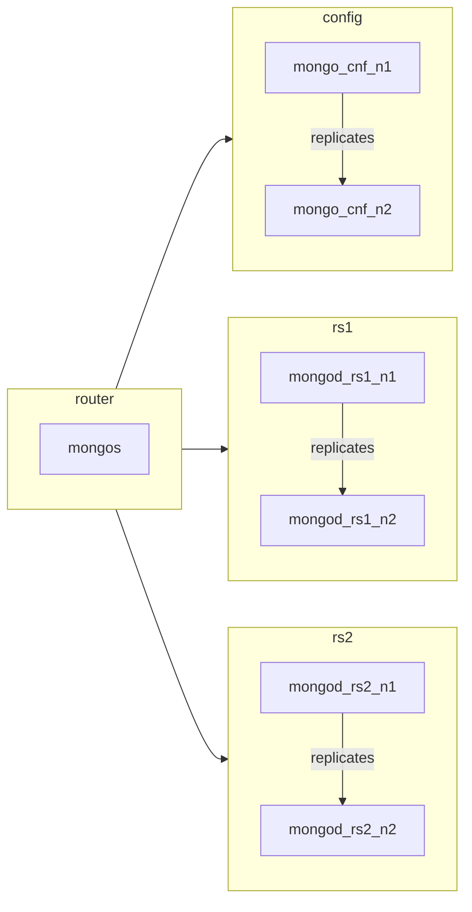

# MongoDB Sharded Cluster with Docker Compose

Пример развертывания шардированного кластера MongoDB согласно схеме:



Из кластера запаблишен порт `27017` для подключения к кластеру. 

## Проверить конфигурацию

Чтобы проверить конфигурацию после деплоя:

1. Подключаемся к контейнеру `mongos`:
```shell
docker exec <ID контейнера, который можно посмотреть через docker ps> /bin/bash mongosh --eval "sh.status()"
```
2. Должны получить примерно такой вывод:
```text
shardingVersion
{ _id: 1, clusterId: ObjectId("650acd33e150e4f5ed054864") }
---
shards
[
  {
    _id: 'mongo_rs1',
    host: 'mongo_rs1/mongo_rs1_n1:27017,mongo_rs1_n2:27017',
    state: 1,
    topologyTime: Timestamp({ t: 1695206721, i: 1 })
  },
  {
    _id: 'mongo_rs2',
    host: 'mongo_rs2/mongo_rs2_n1:27017,mongo_rs2_n2:27017',
    state: 1,
    topologyTime: Timestamp({ t: 1695206930, i: 1 })
  }
]
---
active mongoses
[ { '5.0.21': 1 } ]
---
autosplit
{ 'Currently enabled': 'yes' }
---
balancer
{
  'Currently enabled': 'yes',
  'Currently running': 'no',
  'Failed balancer rounds in last 5 attempts': 0,
  'Migration Results for the last 24 hours': 'No recent migrations'
}
---
databases
[
  {
    database: { _id: 'config', primary: 'config', partitioned: true },
    collections: {}
  },
  {
    database: {
      _id: 'someDB',
      primary: 'mongo_rs2',
      partitioned: true,
      version: {
        uuid: new UUID("9c8a156d-b201-4871-bb5e-b5bdf8145b85"),
        timestamp: Timestamp({ t: 1695206930, i: 3 }),
        lastMod: 1
      }
    },
    collections: {
      'someDB.movieLikes': {
        shardKey: { movie_id: 'hashed' },
        unique: false,
        balancing: true,
        chunkMetadata: [
          { shard: 'mongo_rs1', nChunks: 2 },
          { shard: 'mongo_rs2', nChunks: 2 }
        ],
        chunks: [
          { min: { movie_id: MinKey() }, max: { movie_id: Long("-4611686018427387902") }, 'on shard': 'mongo_rs1', 'last modified': Timestamp({ t: 1, i: 0 }) },
          { min: { movie_id: Long("-4611686018427387902") }, max: { movie_id: Long("0") }, 'on shard': 'mongo_rs1', 'last modified': Timestamp({ t: 1, i: 1 }) },
          { min: { movie_id: Long("0") }, max: { movie_id: Long("4611686018427387902") }, 'on shard': 'mongo_rs2', 'last modified': Timestamp({ t: 1, i: 2 }) },
          { min: { movie_id: Long("4611686018427387902") }, max: { movie_id: MaxKey() }, 'on shard': 'mongo_rs2', 'last modified': Timestamp({ t: 1, i: 3 }) }
        ],
        tags: []
      }
    }
  },
  {
    database: {
      _id: 'test',
      primary: 'mongo_rs2',
      partitioned: false,
      version: {
        uuid: new UUID("9f9eb211-0629-4214-8b3a-2a289369d121"),
        timestamp: Timestamp({ t: 1695206930, i: 7 }),
        lastMod: 1
      }
    },
    collections: {}
  }
]
```

## Изменение конфигурации

1. Чтобы изменить имя базы данных нужно поменять значение в переменной `MONGO_INITDB_DATABASE` контейнера `mongos`.
2. Конфигурация шардирования описано в файле [sharded_cluster_setup.js](./sharded_cluster_setup.js). Если изменили имя базы данных, то необходимо его изменить и в этом файле. Так же можно вносить изменения в шардирование, [подробнее тут](https://www.mongodb.com/docs/manual/core/sharding-shard-key/).